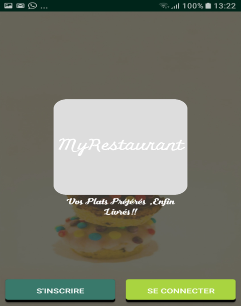
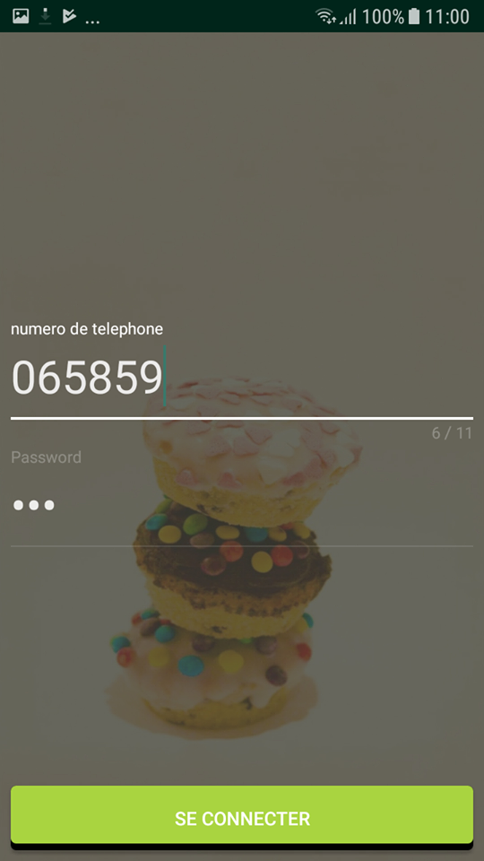
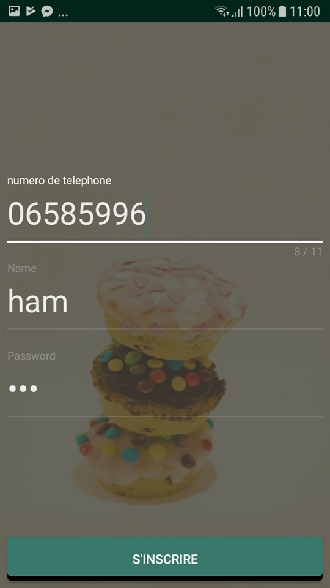
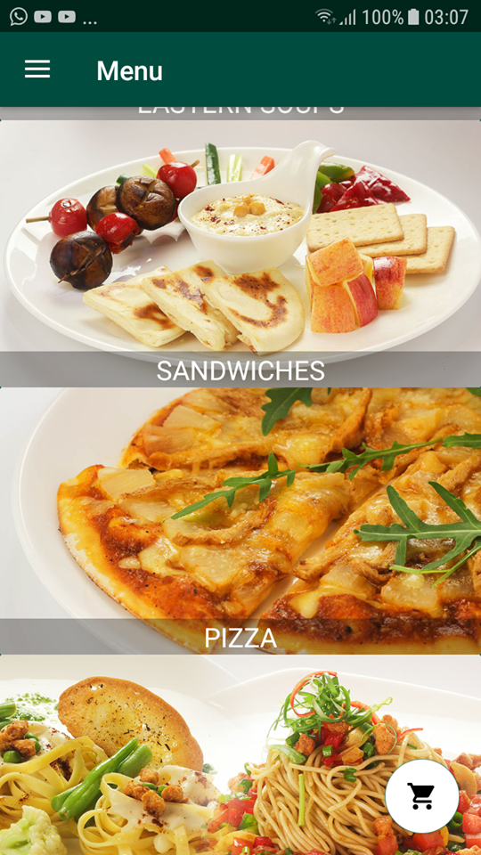
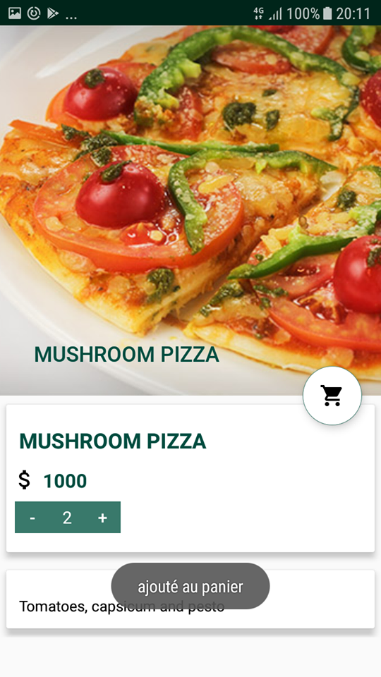
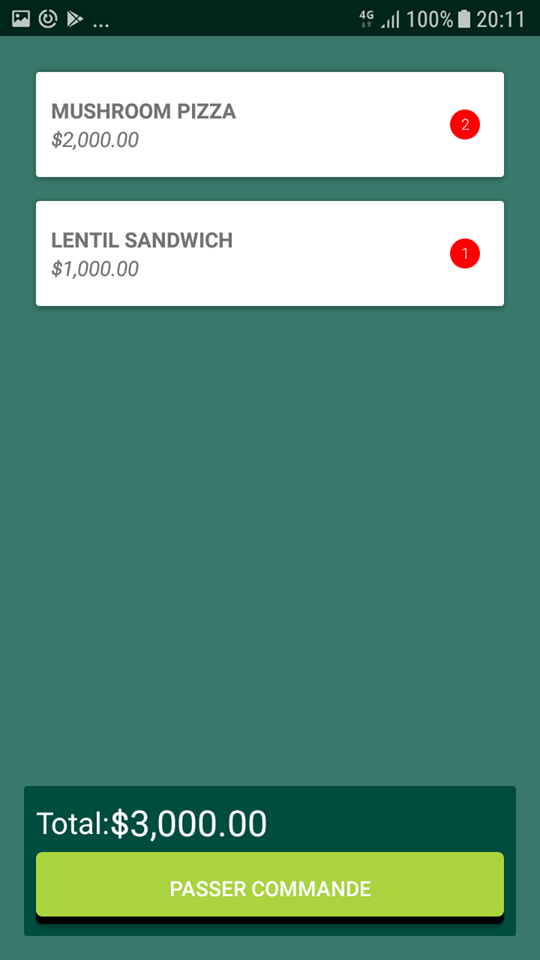
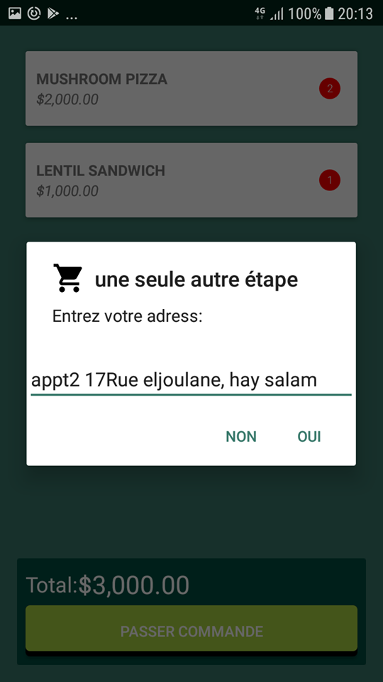

# E-restaurant
partie mobile de l'application "gestion de restauration" (PFA)
          
          a. Vue d’Accueil : 

La figure  ci-dessous représente la vue d’accueil de l’application Android, tel que c’est la première vue que l’utilisateur de notre application Android rencontre au cours de son utilisation. 
Il a le choix entre s’identifier ou bien de s’inscrire si il est nouveau.
 

          b.	Vue d’identification :
La figure  représente la vue ou le client s’identifie sur l’application pour effectuer des commandes. 
Le client s’identifie à l’aide d’un numéro téléphone et un mot de passe donné par la réception.     
       
       
        d. Vue des Plats:   
   
   
        

          e- Passer Commande

